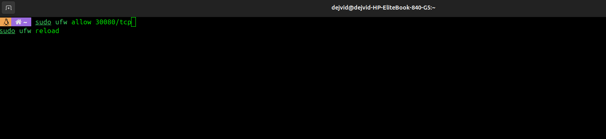
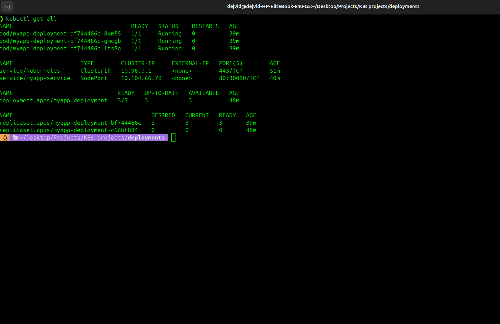

# My Kubernetes Adventure: From Zero to a Working Deployment

This project documents my journey deploying an Nginx application on Kubernetes. I faced errors, troubleshooting, and firewall issues, but finally made it fully functional. Along the way, I captured **10 screenshots** to visualize each step.

---

## Table of Contents

1. [Introduction](#introduction)
2. [Deployment Creation](#deployment-creation)
3. [Troubleshooting Errors](#troubleshooting-errors)
4. [Service Exposure](#service-exposure)
5. [Firewall & NodePort](#firewall--nodeport)
6. [Conclusion & Screenshots](#conclusion--screenshots)

---

## Introduction

Deploying Kubernetes can be challenging. Matching labels, correct YAML structure, and network accessibility are all critical. This guide shows my journey from “it doesn’t work” to “live and accessible.”
First I installed Minicube locally on my laptop:


---

## The Journey (Aligned With Screenshots)

Below is the real story of this Kubernetes task, aligned **step‑by‑step with the actual screenshots** captured during troubleshooting and validation.

---

### Step 1 – First Deployment Attempt

I started by creating my first Kubernetes Deployment. This YAML defines an **Nginx Deployment** with three replicas. At this stage, my goal was simply to get Pods running.

```yaml
apiVersion: apps/v1
kind: Deployment
metadata:
  name: myapp-deployment
  labels:
    app: nginx
    tier: frontend
spec:
  replicas: 3
  selector:
    matchLabels:
      app: nginx
  template:
    metadata:
      labels:
        app: nginx
    spec:
      containers:
      - name: nginx
        image: nginx:1.14.2
        ports:
        - containerPort: 80
```


---

### Step 2 – Pods Created but Not Yet Verified

After creating the Deployment, I checked the Pod status. This confirmed that Kubernetes was attempting to run the application.


---

### Step 3 – Validation & Configuration Errors

At this point, I ran into validation and configuration issues. Some YAML fields were misplaced, and Kubernetes rejected the configuration. This forced me to revisit label matching and structure.


---

### Step 4 – Deployment Fixed and Pods Running

After correcting the YAML (labels, selectors, and container configuration), the Deployment finally stabilized. All replicas were running successfully.


---

### Step 5 – Service Creation

With the Pods running, I needed a way to expose them externally. For that, I created a **NodePort Service**. This Service forwards traffic from a node port to port 80 on the Nginx containers.

```yaml
apiVersion: v1
kind: Service
metadata:
  name: myapp-service
spec:
  type: NodePort
  selector:
    app: nginx
  ports:
    - port: 80
      targetPort: 80
      nodePort: 30080
```

After applying the Service, Kubernetes successfully created it, but external access still needed verification.


---

### Step 6 – NodePort Not Reachable

Even though the Service existed, accessing it from the browser failed. This revealed that networking or firewall rules were blocking the NodePort.


---

### Step 7 – Firewall Investigation (UFW)

I identified that UFW was blocking the NodePort range. After explicitly allowing the NodePort, traffic could finally reach the cluster.



---

### Step 8 – Successful Web Access

Once the firewall rule was added, the Nginx welcome page loaded successfully in the browser — a clear sign that everything was working end‑to‑end.


---


---

### Step 10 – Final Stable State

The final state shows a fully functional Kubernetes setup: running Pods, exposed Service, open firewall port, and a reachable web application.



---

## Conclusion

This task was far more than just applying YAML files. It involved understanding:

* How Deployments and Services interact
* Why labels and selectors must match
* Where networking and firewall rules fit into Kubernetes

After multiple failed attempts, troubleshooting steps, and learning moments — everything finally worked. The screenshots above tell the real story of persistence, debugging, and success.

---

**From confusion to clarity — one NodePort at a time. **
