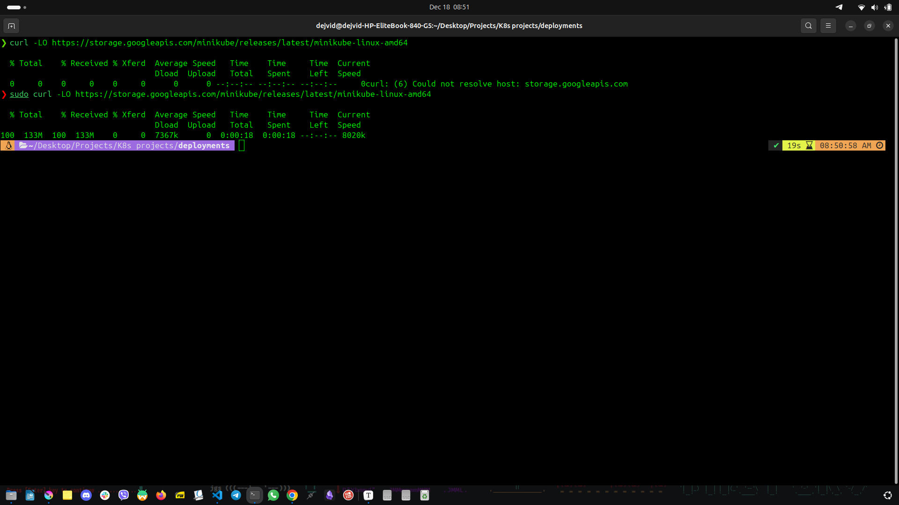
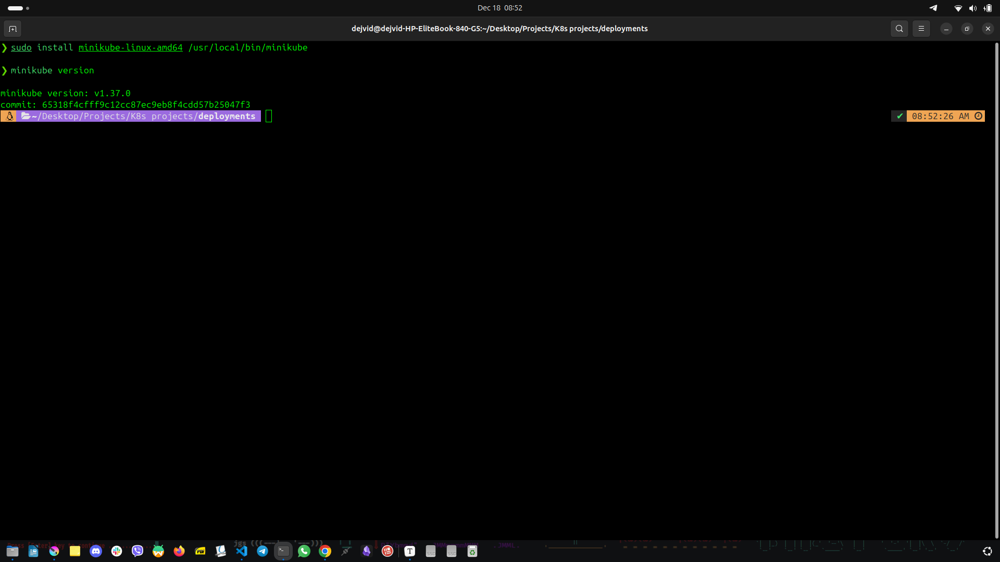
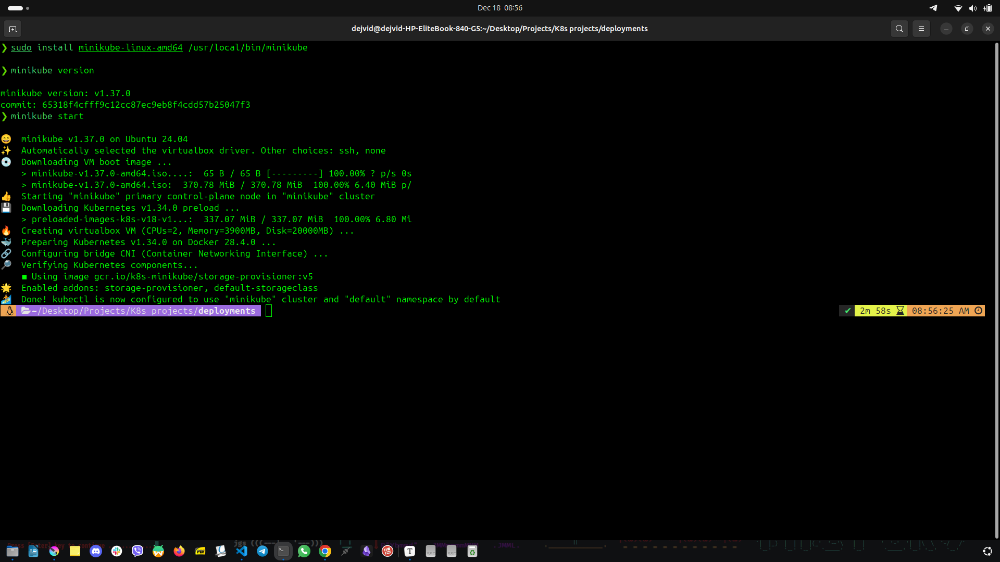
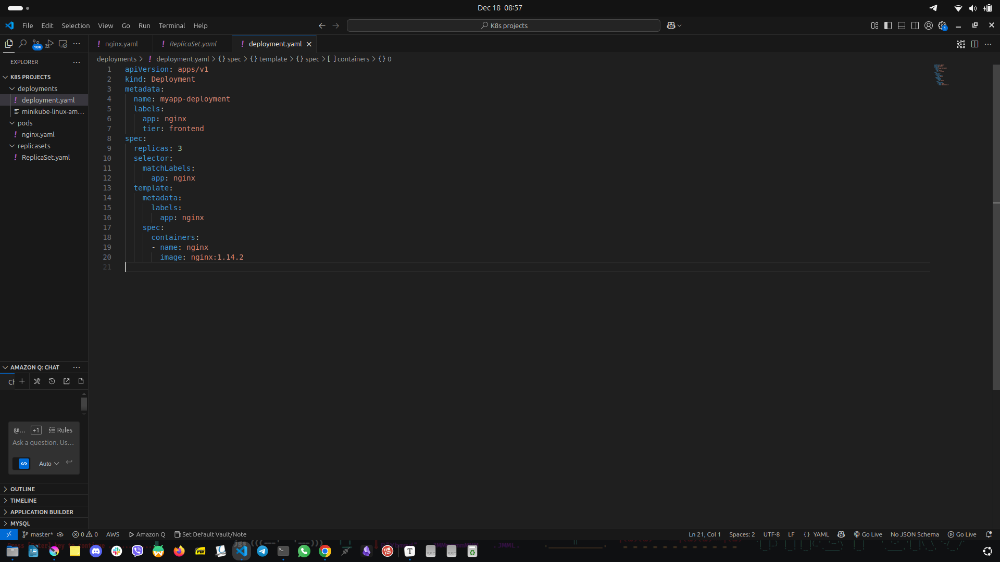
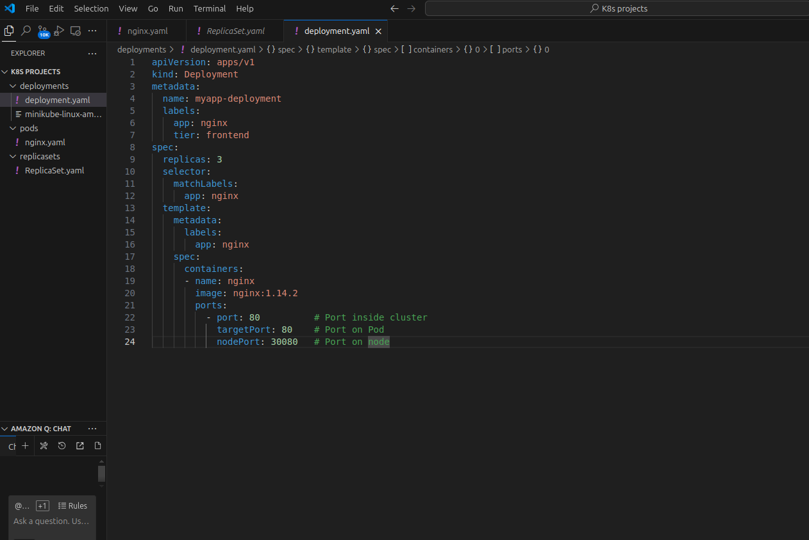
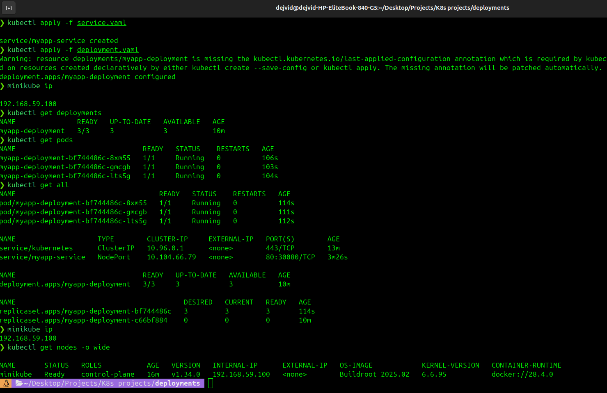
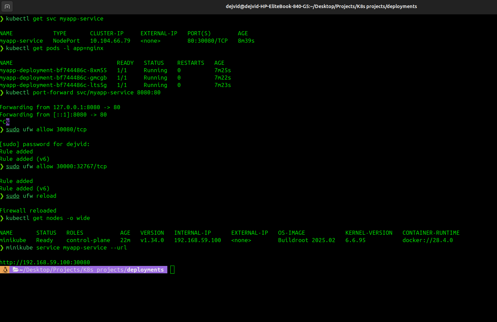
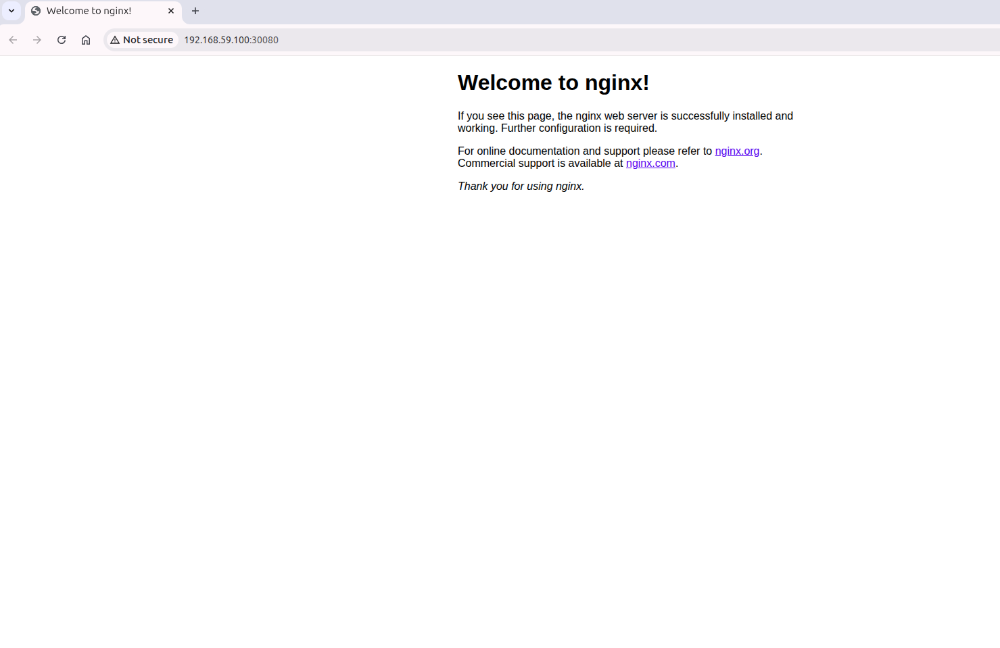
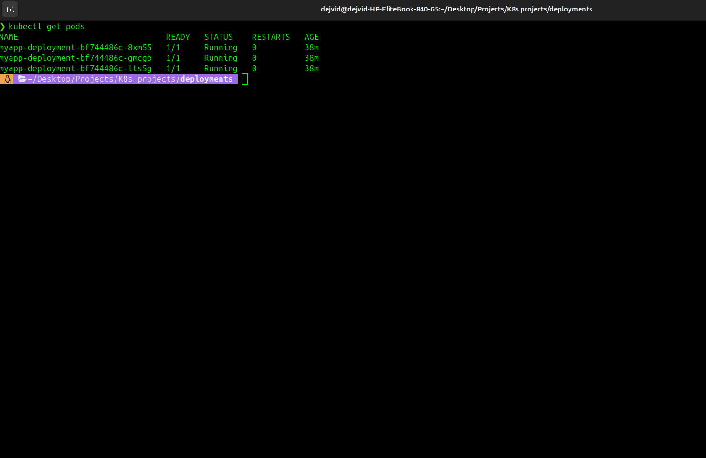

# My Kubernetes Adventure: From Zero to a Working Deployment

This project documents my journey deploying an Nginx application on Kubernetes. I faced errors, troubleshooting, and firewall issues, but finally made it fully functional. Along the way, I captured **10 screenshots** to visualize each step.

---

## Table of Contents

1. [Introduction](#introduction)
2. [Deployment Creation](#deployment-creation)
3. [Troubleshooting Errors](#troubleshooting-errors)
4. [Service Exposure](#service-exposure)
5. [Firewall & NodePort](#firewall--nodeport)
6. [Conclusion & Screenshots](#conclusion--screenshots)

---

## Introduction

Deploying Kubernetes can be challenging. Matching labels, correct YAML structure, and network accessibility are all critical. This guide shows my journey from “it doesn’t work” to “live and accessible.”

---

## Deployment Creation

I created the Nginx Deployment with correct labels, replicas, and container ports:

```yaml
apiVersion: apps/v1
kind: Deployment
metadata:
  name: myapp-deployment
  labels:
    app: nginx
    tier: frontend
spec:
  replicas: 3
  selector:
    matchLabels:
      app: nginx
  template:
    metadata:
      labels:
        app: nginx
    spec:
      containers:
      - name: nginx
        image: nginx:1.14.2
        ports:
        - containerPort: 80
```

| Deployment Applied                                     | Pods Running                                             |
| ------------------------------------------------------ | -------------------------------------------------------- |
|  |  |

*Pods successfully created, 3 replicas running.*

---

## Troubleshooting Errors

I encountered YAML validation errors due to mismatched labels and misconfigured ports. Fixing the Deployment allowed Pods to reach `Running` status.

| Error Example                                           | Fixed Deployment                                            |
| ------------------------------------------------------- | ----------------------------------------------------------- |
|  |  |

---

## Service Exposure

To access Nginx externally, I created a NodePort Service:

```yaml
apiVersion: v1
kind: Service
metadata:
  name: myapp-service
spec:
  type: NodePort
  selector:
    app: nginx
  ports:
    - port: 80
      targetPort: 80
      nodePort: 30080
```

| Service Created                                     | Cluster & Pods Info                                    |
| --------------------------------------------------- | ------------------------------------------------------ |
|  |  |

---

## Firewall & NodePort

The NodePort was initially blocked by UFW. After opening the port:

```bash
sudo ufw allow 30080/tcp
sudo ufw status
```

I could access the application at `http://<node-ip>:30080`.

| NodePort Accessible                                     | Web Page Served                                     |
| ------------------------------------------------------- | --------------------------------------------------- |
|  |  |

---

## Conclusion & Screenshots

This journey taught me:

- Deployment and Pod labels must match  
- NodePort access requires firewall configuration  
- Kubernetes troubleshooting is iterative and rewarding

| Pod Details                                    | `kubectl get all`                                      |
| ---------------------------------------------- | ------------------------------------------------------ |
|  |  |


---

**Enjoy exploring Kubernetes!**
